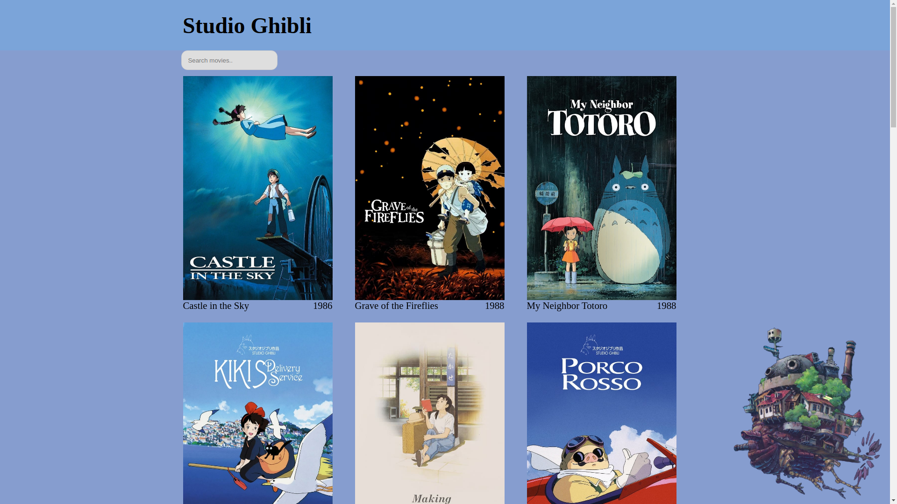

# Ghibli movies 

> Projeto feito consumindo api contendo dados sobre filmes do studio Ghibli onde vc pode visualizar uma lista de filmes e clikando no banner vc é direcionado a uma página com as principais informações sobre. Você pode pesquisar pelos filmes digitando no input e assim facilitar a procura.

## Tecnologias utilizadas
- React router dom
- React transition group
- Redux
- Styled Components
- Axios
- Prop-types

Nesse Desafio de projeto coloquei em pratica os conceitos aprendidos do curso de react no bootcamp Spread Fullstack Developer na *[Digital Innovation One](https://www.dio.me/)* 
Foi um projeto bem legal de fazer , tive dificuldade no inicio com o redux mas lendo a documentação descobri uma forma de facilitar o fetching de informações da api utilizando o [RTK query](https://redux.js.org/tutorials/essentials/part-7-rtk-query-basics)

## Começando

Para colocar uma cópia local em execução, siga estas etapas de exemplo simples.

### Pré-requisitos
Instale o Node e o npm usando o comando `npm install` em sua linha de comando.

### Configuração
Clone este repositório digitando `git clone https://github.com/Michael-Philipe/Ghibli-movies.git` no seu terminal.

### Instalar
Execute `npm install` em sua linha de comando.

### Uso
Navegue até o diretório do projeto `cd studio_ghibli` e execute `npm start`.

## Autor

👤 **Michael Philipe**

- GitHub: [Github](https://github.com/Michael-Philipe)
- LinkedIn: [LinkedIn](https://www.linkedin.com/in/michaelphilipe/)

## Links úteis 

- [Studio Ghibli API (v1.0.1)](https://ghibliapi.herokuapp.com/#)
- [Animated Transitions with React Router v5](https://youtu.be/jMl0qOgcf6Y)
- [How to Connect to an API with JavaScript](https://www.taniarascia.com/how-to-connect-to-an-api-with-javascript/)